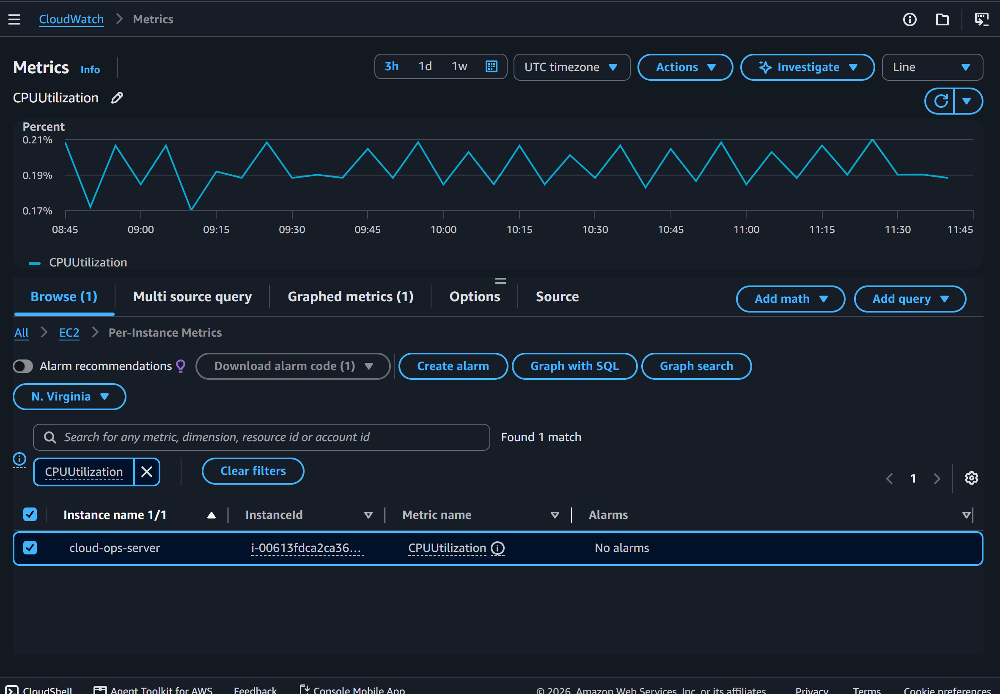
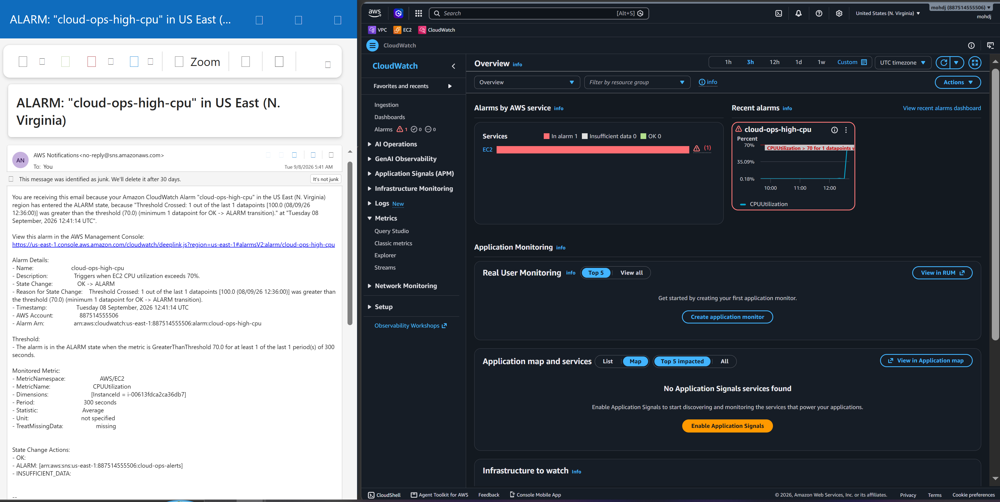
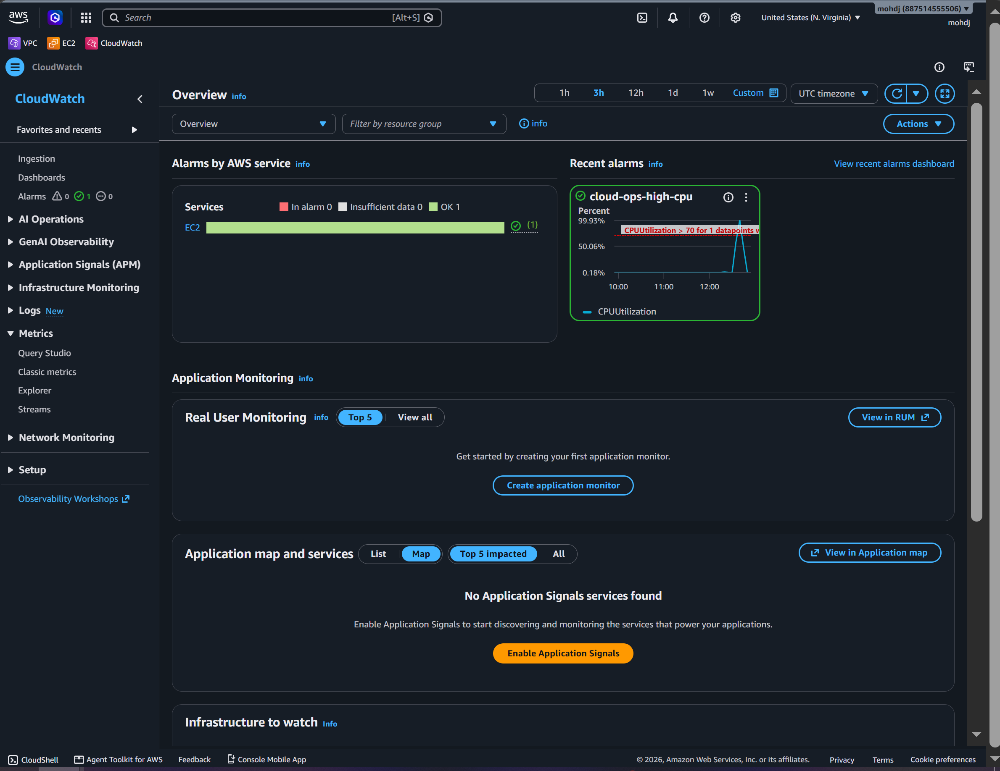
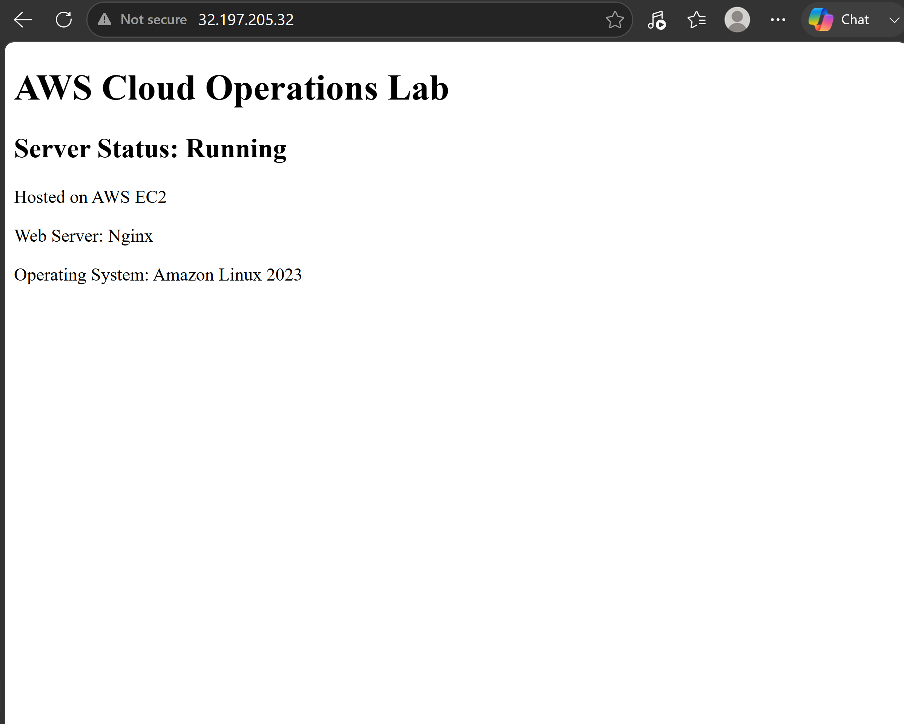
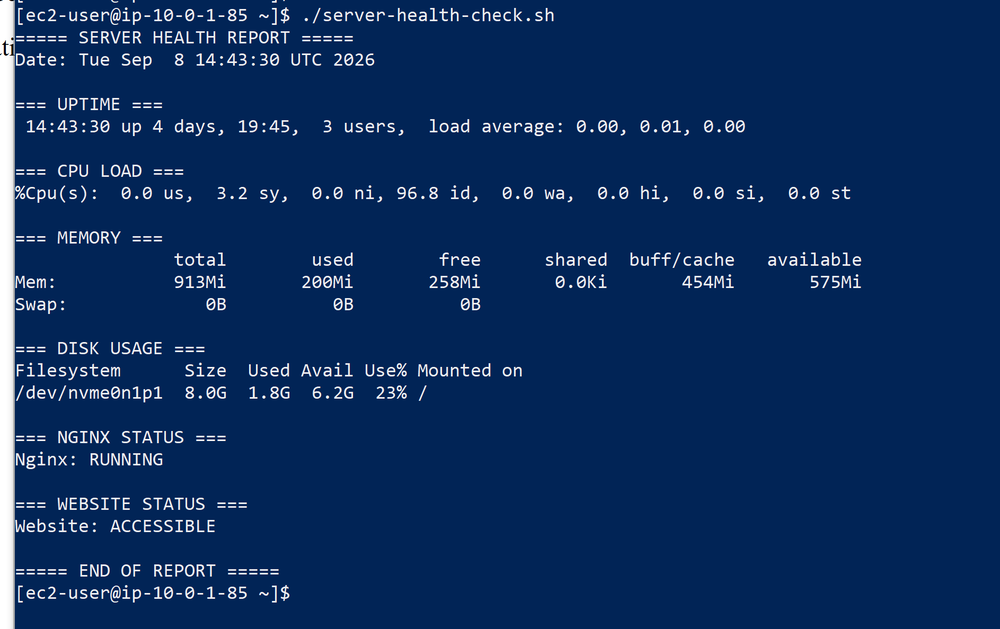
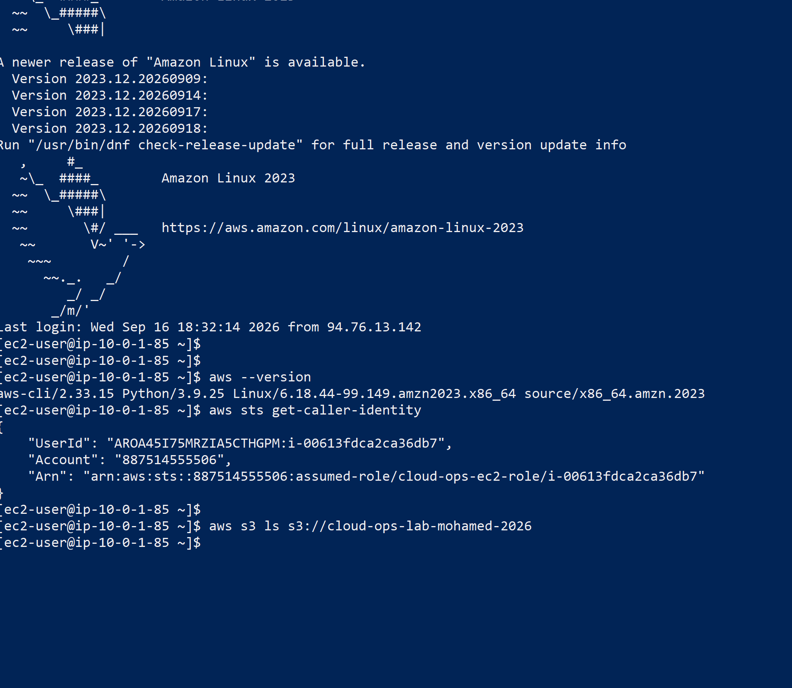
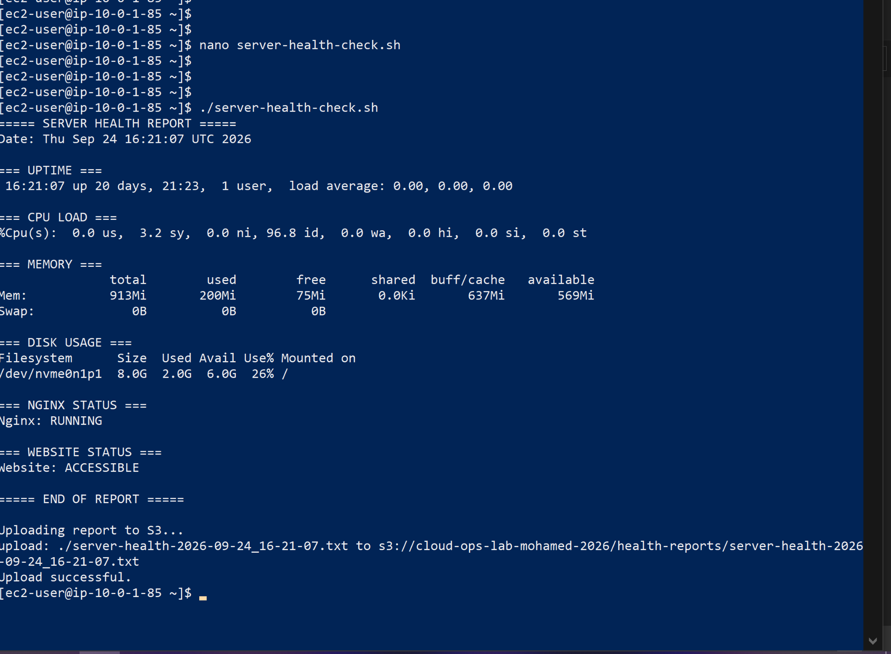
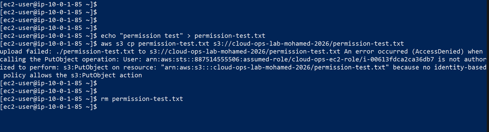
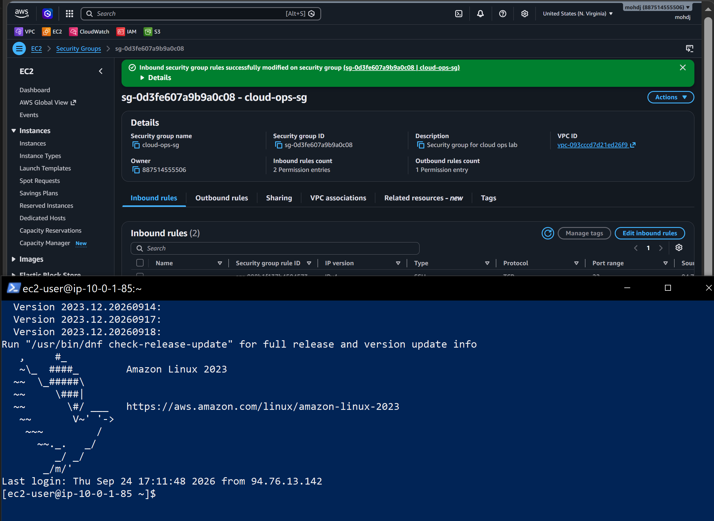
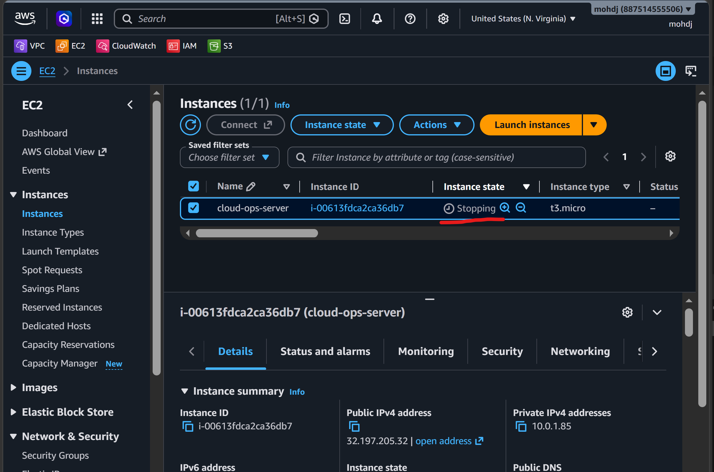

# AWS Cloud Operations Lab

A hands-on AWS Cloud Operations project focused on cloud infrastructure, Linux administration, monitoring, troubleshooting, security, automation, and resource management.

## Architecture


The architecture includes a public EC2 web server running Nginx, CloudWatch monitoring, CPU alarms, SNS email notifications, IAM role-based access, and Amazon S3 health report storage.

## AWS Infrastructure

- VPC: `cloud-ops-vpc`
- CIDR: `10.0.0.0/16`
- Public Subnet: `10.0.1.0/24`
- Internet Gateway
- Route Table with `0.0.0.0/0` route
- Security Group
- EC2 Instance: `cloud-ops-server`
- Amazon Linux 2023
- Nginx Web Server
- IAM Role
- Amazon S3

## Network Security

Configured the EC2 Security Group with:

- HTTP (Port 80) accessible publicly
- SSH (Port 22) restricted to my trusted public IP
- Applied least-privilege access principles where possible

## Linux Administration

- SSH access
- Linux users and permissions
- sudo privileges
- Service management using systemd
- Log investigation using journalctl
- Disk monitoring
- Memory monitoring
- CPU monitoring
- Server uptime and load checks

## Monitoring

Configured AWS CloudWatch monitoring for the EC2 instance.

Monitored metrics include:

- CPU Utilization
- Network In
- Network Out
- EC2 Status Checks

Configured a CloudWatch alarm:

- Alarm: `cloud-ops-high-cpu`
- Threshold: CPU > 70%
- Notification: Amazon SNS Email Alert

## IAM & S3

Created an EC2 IAM role:

`cloud-ops-ec2-role`

Security configuration includes:

- Used IAM role-based access instead of storing AWS access keys on the EC2 server
- Configured S3 permissions using least-privilege principles
- Allowed health reports to be uploaded only to:

```text
s3://cloud-ops-lab-mohamed-2026/health-reports/
```

- Verified unauthorized uploads outside the permitted S3 path returned `AccessDenied`

## Automated Health Reports

Created a Bash health-check script:

```text
scripts/server-health-check.sh
```

The script checks:

- CPU
- Memory
- Disk Usage
- Uptime
- Nginx Status
- Website Availability

The script then:

1. Generates a timestamped health report
2. Saves the report locally
3. Uploads the report automatically to Amazon S3

Example:

```text
server-health-2026-09-24_16-21-07.txt
```

## Troubleshooting Incidents

### Incident 01 - High CPU Utilization

Simulated high CPU utilization to test monitoring and alerting.

**Investigation:**

- Checked CloudWatch CPU metrics
- Connected to the EC2 instance via SSH
- Checked system CPU utilization

**Root Cause:**

High CPU load generated during a stress test.

**Resolution:**

- Stopped the stress workload
- Verified CPU utilization returned to normal
- Confirmed the CloudWatch alarm returned to the OK state

---

### Incident 02 - Website Down

Simulated a web service outage by stopping Nginx.

**Investigation:**

- Verified EC2 connectivity using SSH
- Tested the website locally using `curl`
- Checked the Nginx service status
- Reviewed the service condition using systemd

**Root Cause:**

The Nginx service was stopped.

**Resolution:**

- Restarted Nginx
- Verified the service returned to `active (running)`
- Confirmed the website was accessible again

## Project Screenshots

### CloudWatch CPU Monitoring



### High CPU Alarm Triggered



### CPU Alarm Recovery



### Website Recovery



### Automated Server Health Check



### IAM Role & S3 Access



### S3 Health Report Upload



### IAM Least Privilege Test



### SSH Security Hardening



### Resource Management



## Cost & Resource Management

- Stopped the EC2 instance when not in use to reduce unnecessary resource consumption
- Monitored AWS resources during the lab
- Maintained the environment so it can be restarted for future testing and demonstrations
- Avoided leaving unnecessary compute resources running

## Project Structure

```text
aws-cloud-operations-lab/
├── architecture/
│   └── aws-cloud-architecture.png
├── scripts/
│   └── server-health-check.sh
├── incidents/
│   ├── incident-01-high-cpu.md
│   └── incident-02-website-down.md
├── screenshots/
└── README.md
```

## Skills Practiced

- AWS
- Amazon EC2
- Amazon VPC
- IAM
- Amazon S3
- CloudWatch
- Amazon SNS
- Linux Administration
- Networking
- Nginx
- Bash Scripting
- Monitoring & Alerting
- Incident Troubleshooting
- Git
- GitHub
- Least Privilege Access
- Cloud Security Fundamentals
- Cost & Resource Management