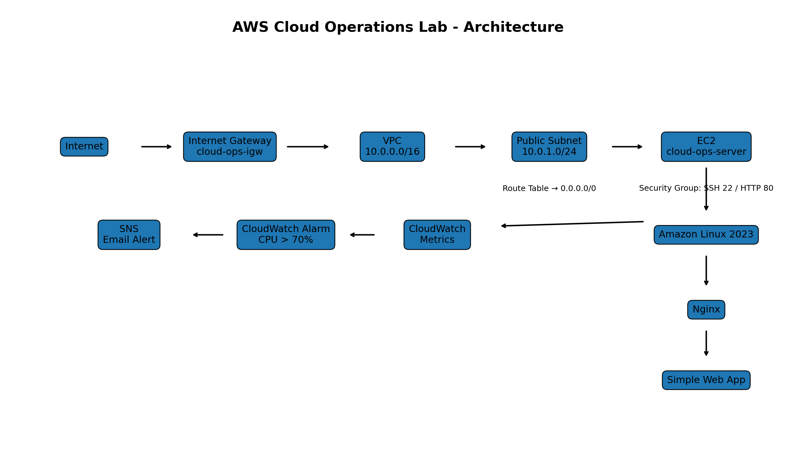

# AWS Cloud Operations Lab

A hands-on AWS Cloud Operations project focused on infrastructure, Linux administration, monitoring, troubleshooting, and automation.
## Architecture



The architecture includes a public EC2 web server running Nginx, CloudWatch monitoring, CPU alarms, and SNS email notifications.

## AWS Infrastructure

- VPC: `cloud-ops-vpc`
- CIDR: `10.0.0.0/16`
- Public Subnet: `10.0.1.0/24`
- Internet Gateway
- Route Table
- Security Group
- EC2 Instance: `cloud-ops-server`
- Amazon Linux 2023
- Nginx Web Server

## Linux Administration

- SSH access
- Linux users and permissions
- sudo privileges
- Service management using systemd
- Log investigation using journalctl
- Disk monitoring
- Memory monitoring
- Server uptime checks

## Monitoring

Configured AWS CloudWatch monitoring for the EC2 instance.

Monitored metrics include:

- CPU Utilization
- Network In
- Network Out
- EC2 Status Checks

Configured a CloudWatch alarm:

- Alarm: `cloud-ops-high-cpu`
- Threshold: CPU > 70%
- Notification: Amazon SNS Email Alert

## Troubleshooting Incidents

### Incident 01 - High CPU

Simulated high CPU utilization using a stress test.

Investigation:
- Checked CloudWatch metrics
- Connected to EC2 via SSH
- Checked CPU utilization

Resolution:
- Stopped the stress test
- Verified CPU returned to normal

### Incident 02 - Website Down

Simulated a website outage by stopping Nginx.

Investigation:
- Verified EC2 SSH connectivity
- Tested localhost using curl
- Checked Nginx service status

Root Cause:
- Nginx service was stopped

Resolution:
- Restarted Nginx
- Verified the website was accessible

## Automation

Created a Bash script:

`scripts/server-health-check.sh`

The script checks:

- CPU
- Memory
- Disk Usage
- Uptime
- Nginx Status
- Website Availability

## Project Structure

```text
aws-cloud-operations-lab/
├── scripts/
│   └── server-health-check.sh
├── incidents/
│   ├── incident-01-high-cpu.md
│   └── incident-02-website-down.md
├── screenshots/
└── README.md
```

## Skills Practiced

- AWS
- Linux
- Networking
- EC2
- VPC
- Nginx
- CloudWatch
- SNS
- Troubleshooting
- Bash
- Git
- GitHub